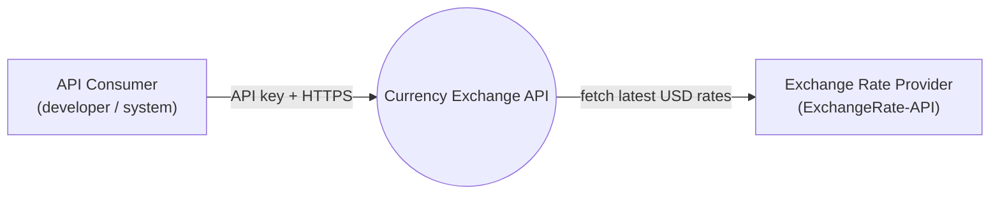
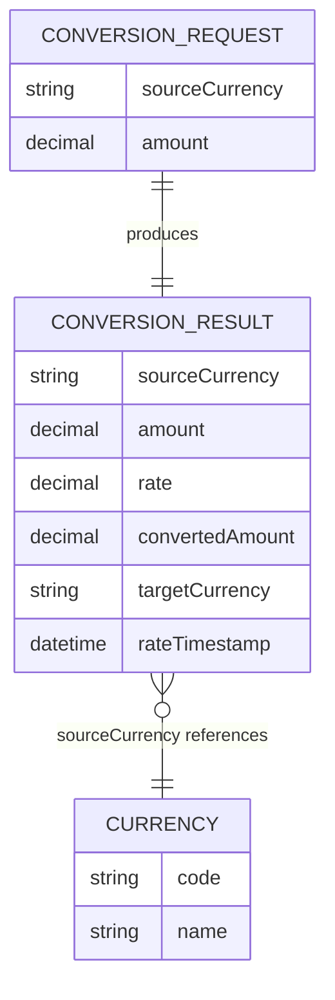
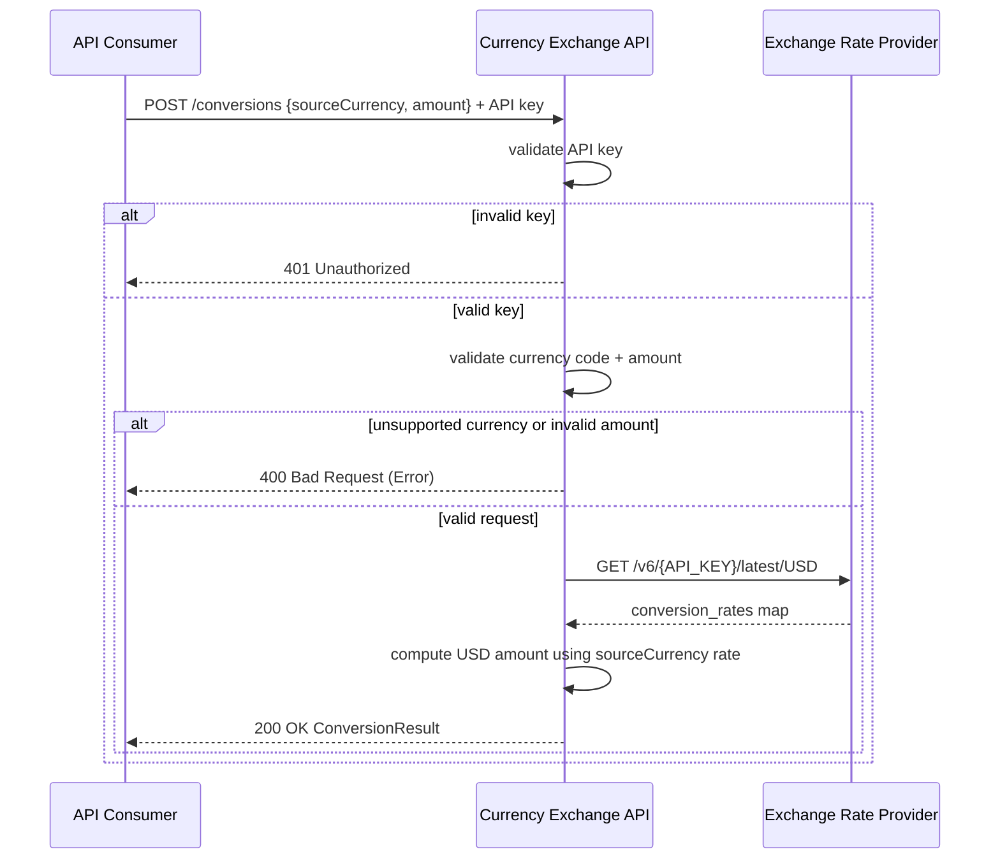

# Currency Exchange API — Design

A single Ballerina service, `currency-exchange-api`, exposed directly to the internet. API Consumers call it with a shared API key to convert an amount in a given source currency to its USD equivalent, using current rates it fetches from an external exchange-rate provider. There is no persistence and no web UI — the service is stateless, fetching a fresh rate per request (or a short-lived cached one) from the upstream provider.

## Context (C1)

## Domain model (ER)

## Key flows

